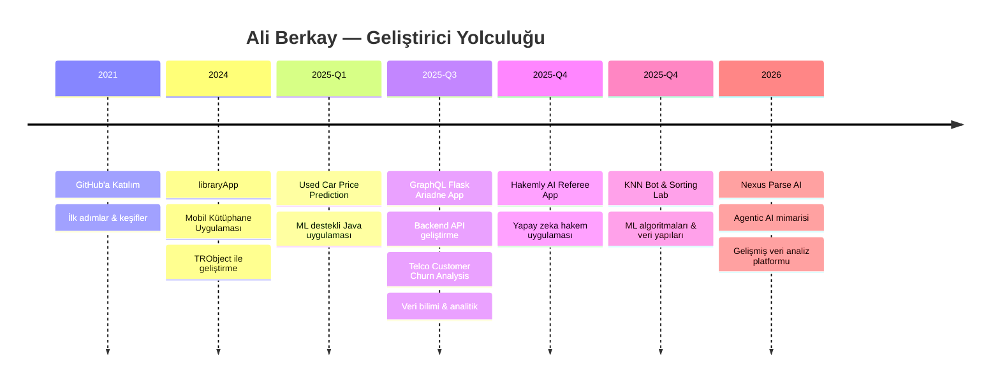

<div align="center">

<!-- Animated Header -->


<!-- Typing Animation -->
<a href="https://git.io/typing-svg"></a>

<br/>

<!-- Social / Contact Badges -->
[](https://github.com/DemonstrativeAli)
[](https://github.com/DemonstrativeAli?tab=followers)
[](https://github.com/DemonstrativeAli)

</div>

---

## 🧑‍💻 Hakkımda

```yaml
name: Ali Berkay
role: AI / ML Engineer & Data Scientist
location: Türkiye 🇹🇷
education: Bilgisayar Mühendisliği
interests:
  - Yapay Zeka & Makine Öğrenmesi
  - Veri Bilimi & Analitik
  - Full-Stack Web Geliştirme
  - Mobil Uygulama Geliştirme
currently_working_on: AI-powered applications & Data Science projects
fun_fact: "Veriyi sanata dönüştürmeyi seviyorum 🎨📊"
```

---

## 🛠️ Teknoloji & Araçlar

<div align="center">

### 💻 Programlama Dilleri


### 🤖 AI / ML & Veri Bilimi


### 🌐 Web & Backend


### 🔧 Araçlar & Platformlar


</div>

---

## 🚀 Öne Çıkan Projeler

<div align="center">

<a href="https://github.com/DemonstrativeAli/Used-Car-Price-Prediction-Java-Application">
  
</a>
<a href="https://github.com/DemonstrativeAli/Telco-Customer_Churn_Analysis">
  
</a>
<a href="https://github.com/DemonstrativeAli/GraphQL_Flask_Ariadne-App">
  
</a>
<a href="https://github.com/DemonstrativeAli/Hakemly-AI-Referee-App-">
  
</a>
<a href="https://github.com/DemonstrativeAli/sorting-lab">
  
</a>
<a href="https://github.com/DemonstrativeAli/KNN_K_Nearest_Neighbor_Bot">
  
</a>

</div>

---

## 📊 GitHub İstatistikleri

<div align="center">


<br/>

<!-- Streak Stats -->


<br/>

<!-- Activity Graph -->


</div>

---

## 🏆 GitHub Başarıları

<div align="center">


</div>

---

## 📈 Proje Yolculuğum



---

## 🎯 Odak Alanlarım

<div align="center">

| 🤖 **Yapay Zeka & ML** | 📊 **Veri Bilimi** | 🌐 **Web Geliştirme** | 📱 **Mobil** |
|:---:|:---:|:---:|:---:|
| KNN, Decision Trees | Pandas, NumPy | Flask, GraphQL | TRObject |
| Scikit-Learn | Jupyter Notebooks | FastAPI, React | Mobile Apps |
| Model Training | Data Visualization | REST & GraphQL APIs | Cross-Platform |
| Price Prediction | Churn Analysis | Ariadne | Library Systems |

</div>

---

## 🐍 Contribution Snake

<div align="center">

<picture>
  <source media="(prefers-color-scheme: dark)" srcset="https://raw.githubusercontent.com/DemonstrativeAli/DemonstrativeAli/output/github-snake-dark.svg" />
  <source media="(prefers-color-scheme: light)" srcset="https://raw.githubusercontent.com/DemonstrativeAli/DemonstrativeAli/output/github-snake.svg" />
  
</picture>

</div>

> 💡 *Snake animasyonunu aktifleştirmek için [bu rehberi](https://github.com/Platane/snk) takip ederek GitHub Actions ile otomatik oluşturabilirsiniz.*

---

<div align="center">

### 💬 Bana Ulaşın

*Projelerim hakkında soru sormak veya işbirliği yapmak isterseniz, GitHub üzerinden bana ulaşabilirsiniz!*

<br/>

[](https://github.com/DemonstrativeAli)

<br/>


</div>
